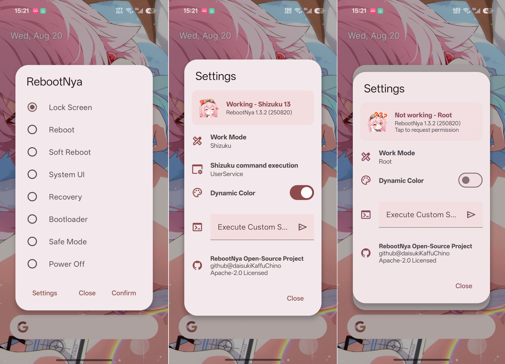

# RebootNya

## 简介/Introduction

RebootNya 是一款简单的高级重启应用，同时支持 **Root** 和 **[Shizuku](https://shizuku.rikka.app/)** 工作方式！

RebootNya is a simple yet advanced reboot application that supports both **Root** and **[Shizuku](https://shizuku.rikka.app/)**!

## 开发背景/Development Background

我的一台旧手机电源键与音量键都损坏了，我迫切需要一个兼顾美观、轻量和易用的高级重启应用。

One of my old phones has both the power and volume buttons broken, so I urgently needed an advanced reboot app that is aesthetically pleasing, lightweight, and easy to use.

## 已知问题/Known Issues

在 ColorOS 默认启动器上可能无法显示透明背景。

The transparent background may not display properly on the default launcher of ColorOS.

## 开源许可/Licenses

- **[RebootNya](https://github.com/daisukiKaffuChino/RebootNya)**: Apache-2.0 license
- **[Android Jetpack](https://github.com/androidx/androidx)**: Apache-2.0 license
- **[Material Components for Android](https://github.com/material-components/material-components-android)**: Apache-2.0 license
- **[libsu](https://github.com/topjohnwu/libsu)**: Apache-2.0 license
- **[RikkaX](https://github.com/RikkaApps/RikkaX)**: MIT license
- **[Shizuku-API](https://github.com/RikkaApps/Shizuku-API)**: Apache-2.0 license
