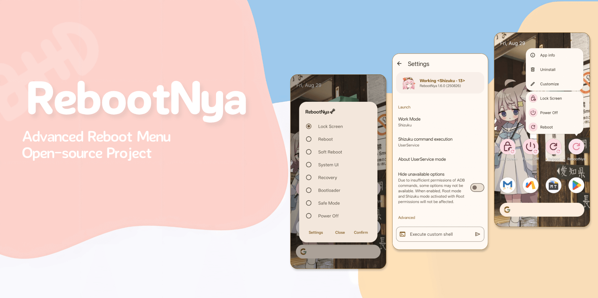

[English](README.md) | 简体中文



# RebootNya

[](https://github.com/daisukiKaffuChino/RebootNya/releases)

[](https://github.com/daisukiKaffuChino/RebootNya/releases/latest)
[](https://crowdin.com/project/rebootnya)
[](https://github.com/daisukiKaffuChino/RebootNya/blob/master/LICENSE)

RebootNya 是一款简单的高级重启应用，同时支持 **Root** 和 **[Shizuku](https://shizuku.rikka.app/)** 工作方式！

已在一些设备上进行测试，在 Android 8.1 ~ 16 上运行良好。

> 在一些 ROM 的默认启动器上可能无法正确显示透明背景，例如 ColorOS 15。解决方案是更换启动器，比如 Lawnchair 等。

## 使用 Intent 进行控制

RebootNya 现在支持通过特定 Intent(意图) 启动和关闭应用程序，允许与外部自动化工具集成。将以下意图发送给类 `github.daisukikaffuchino.rebootnya.MainActivity` 以使用该功能。

```xml
<!-- 启动应用 -->
<action android:name="github.daisukikaffuchino.rebootnya.action.LAUNCH" />
<!-- 关闭应用 -->
<action android:name="github.daisukikaffuchino.rebootnya.action.CLOSE" />
<!-- 切换界面可见性 -->
<action android:name="github.daisukikaffuchino.rebootnya.action.TOGGLE" />
```

## 开发背景

我的一台旧手机电源键与音量键都损坏了，因此迫切需要一个兼顾美观、轻量和易用的高级重启应用。

## 贡献者

欢迎参与贡献！你可以 [提出 Issue](https://github.com/daisukiKaffuChino/RebootNya/issues/new/choose) 或为我们提交拉取请求 (PR)。

本项目的存在需要感谢所有的贡献者。


## 开源许可

- **[RebootNya](https://github.com/daisukiKaffuChino/RebootNya)**: Apache-2.0 license
- **[Android Jetpack](https://github.com/androidx/androidx)**: Apache-2.0 license
- **[Material Components for Android](https://github.com/material-components/material-components-android)**: Apache-2.0 license
- **[libsu](https://github.com/topjohnwu/libsu)**: Apache-2.0 license
- **[RikkaX](https://github.com/RikkaApps/RikkaX)**: MIT license
- **[Shizuku-API](https://github.com/RikkaApps/Shizuku-API)**: Apache-2.0 license

<div align="center">
   </br>
</div>
