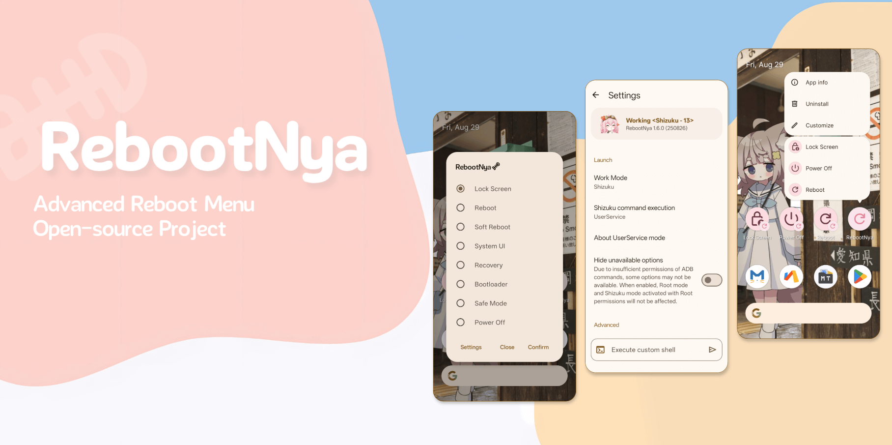

| English | [简体中文](README.zh.md) | [Türkçe](README.tr.md) |



# RebootNya

[](https://apt.izzysoft.de/packages/github.daisukikaffuchino.rebootnya)

[](https://apt.izzysoft.de/packages/github.daisukikaffuchino.rebootnya)
[](https://github.com/daisukiKaffuChino/RebootNya/releases/latest)

[](https://shields.rbtlog.dev/github.daisukikaffuchino.rebootnya)
[](https://crowdin.com/project/rebootnya)
[](https://github.com/daisukiKaffuChino/RebootNya/blob/main/LICENSE)

RebootNya, basit ama gelişmiş bir yeniden başlatma aracıdır ve normalde yükseltilmiş ayrıcalıklar gerektiren çeşitli yeniden başlatma seçeneklerine kolay erişim sağlar. Uygulama hem **Root** hem de **[Shizuku](https://shizuku.rikka.app/)** desteğine sahiptir; bu sayede kullanıcılar yeniden başlatma komutlarını güvenli ve şeffaf bir şekilde yürütebilirler.
Tested on some devices and works well on Android 9 to 16.

> Bazı ROM'ların varsayılan başlatıcısında (launcher), şeffaf arka plan düzgün görüntülenmeyebilir (örneğin, ColorOS 15). Çözüm, Lawnchair gibi başka bir başlatıcıya geçmektir.

## Intent Tabanlı Kontrol

RebootNya artık belirli intent'ler aracılığıyla uygulamanın başlatılmasını ve kapatılmasını destekleyerek harici otomasyon araçlarıyla entegrasyona olanak tanır. Bu özelliği kullanmak için `github.daisukikaffuchino.rebootnya.MainActivity` sınıfına aşağıdaki intent'i gönderin.

```xml
<!-- Launch app -->
<action android:name="github.daisukikaffuchino.rebootnya.action.LAUNCH" />
<!-- Close app -->
<action android:name="github.daisukikaffuchino.rebootnya.action.CLOSE" />
<!-- Switch interface visibility -->
<action android:name="github.daisukikaffuchino.rebootnya.action.TOGGLE" />
```

## Geliştirilme Amacı

Eski telefonlarımdan birinin hem güç hem de ses tuşları bozuktu, bu yüzden estetik açıdan hoş, hafif ve kullanımı kolay gelişmiş bir yeniden başlatma uygulamasına acilen ihtiyacım vardı.

## Katkıda Bulunanlar

Katılmaktan çekinmeyin! [Bir sorun (issue) açın](https://github.com/daisukiKaffuChino/RebootNya/issues/new/choose) veya çekme istekleri (PR) gönderin.

Bu proje, katkıda bulunan tüm insanlar sayesinde var olmaktadır.


## Lisanslar

- **[RebootNya](https://github.com/daisukiKaffuChino/RebootNya)**: Apache-2.0 lisansı
- **[AboutLibraries](https://github.com/mikepenz/AboutLibraries)**: Apache-2.0 lisansı
- **[Android Jetpack](https://github.com/androidx/androidx)**: Apache-2.0 lisansı
- **[Material Components for Android](https://github.com/material-components/material-components-android)**: Apache-2.0 lisansı
- **[libsu](https://github.com/topjohnwu/libsu)**: Apache-2.0 lisansı
- **[RikkaX](https://github.com/RikkaApps/RikkaX)**: MIT lisansı
- **[Shizuku-API](https://github.com/RikkaApps/Shizuku-API)**: Apache-2.0 lisansı

<div align="center">
   </br>
</div>
